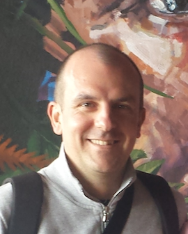

---
# Feel free to add content and custom Front Matter to this file.
# To modify the layout, see https://jekyllrb.com/docs/themes/#overriding-theme-defaults

layout: page
---

**Associate professor** 
*Department of Computer Science* 
*University of Pisa* 
Largo Bruno Pontecorvo 3, I-56127 Pisa, Italy. 
Room: 361 

#### Contacts
Emails
  - *rossano.venturini@unipi.it*
  - *rossano.venturini@gmail.com*

Phone: +39 050 221 3139 
Skype: rossanovent 
Telegram: rossanoventurini 

  
**PC co-chair** (with Gabriele Fici and Marinella Sciortino) of the 24th edition of the International Symposium on String Processing and Information Retrieval, SPIRE 2017.

**Program Committees**: EMNLP-CoNLL'12, CIKM'12,  WSDM'13, CPM'13, CIKM'13, WSDM'14, ESA'14, PODS'15, IIR'15, SIGIR'15, SPIRE'15, AAIM'16, IIR'16, SIGIR'16, WSDM'17, WWW'17,  SEA'17, SIGIR'17, IIR'17, WWW'18, SIGIR'19, and SPIRE'20.

# Awards
- Best paper award at SIGIR 2015: 38th international ACM SIGIR conference on research & development in Information Retrieval
- Best paper award at SIGIR 2014: 37th international ACM SIGIR conference on research & development in Information Retrieval
- Yahoo Faculty Research and Engagement Program award ([FREP](https://research.yahoo.com/news/faculty-research-and-engagement-program-2014-recipients-selected/)), 2014
- Three Best Young Research (under 35) awards at the I.S.T.I. "A. Faedo" – C.N.R. (2011, 2013 e 2014)
- Best Italian PhD Thesis in Theoretical Computer Science of the [Italian Chapter of EATCS](http://www.eatcs.org/index.php/italian-chapter), 2012
